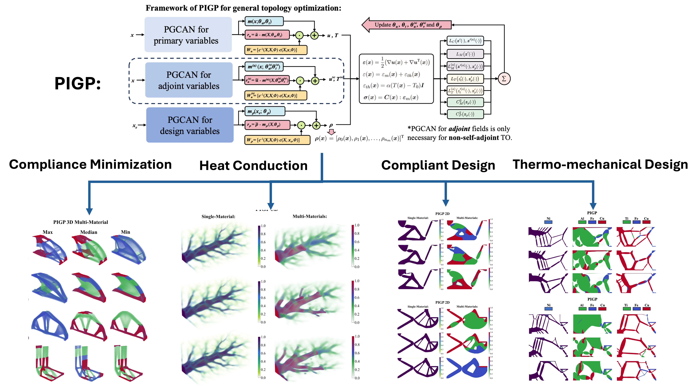

# Multi-Material Topology Optimization via Physics-Informed Gaussian Processes
[](LICENSE)

This repository provides the implementation for our paper on **multi-material multi-physics topology optimization with physics-informed Gaussian process priors**. The code includes representative examples for compliance minimization, heat conduction, compliant mechanism design, and thermo-mechanical design in 2D and 3D settings where applicable.

---

## Framework Overview
The architecture of the proposed framework is illustrated below:



The PIGP framework represents state variables and material-phase fields with GP-based models whose mean functions are parameterized by neural networks. Material distributions and physics fields are optimized simultaneously by minimizing objective, potential-energy, and constraint terms within a physics-informed optimization process.

The repository includes examples for:

1. Multi-material compliance minimization with mass and/or cost constraints in 2D and 3D.
2. Multi-material heat-conduction design in 2D and 3D.
3. Multi-material compliant mechanism design.
4. Thermo-mechanical actuator and gripper design.

---

## Repository Structure

| Folder | Contents |
| --- | --- |
| `compliance minimization 2D/` | 2D compliance-minimization examples with mass, cost, and combined mass-cost constraints. |
| `compliance minimization 3D/` | 3D compliance-minimization examples for single-material and multi-material/mass-cost cases. |
| `heat conduction 2D/` | 2D heat-conduction topology optimization examples. It requires a `Data/` folder. |
| `heat conduction 3D/` | 3D heat-conduction topology optimization examples. |
| `compliant design/` | 2D compliant mechanism examples for single- and multi-material designs. It requires a `Data/` folder. |
| `thermo-mechanical/` | 2D thermo-mechanical design examples with different material systems. It requires a `Data/` folder. |

Each example folder contains its own `models/` and `utils/` subfolders. Run scripts from inside the corresponding example folder so that local imports resolve correctly.

---

## Requirements

We recommend creating a dedicated conda environment:

```bash
conda create --name MMTO python=3.12
conda activate MMTO
```

Install core dependencies:

```bash
# PyTorch with CUDA
conda install pytorch==2.5.1 torchvision==0.20.1 torchaudio==2.5.1 pytorch-cuda=11.8 -c pytorch -c nvidia

# BoTorch and GPyTorch
pip install botorch==0.11.3
pip install gpytorch==1.9.1

# Scientific stack
pip install numpy==2.2.6 scipy==1.16.0 scikit-learn==1.7.0 pandas==2.3.2

# Visualization
pip install matplotlib==3.10.0 vtk==9.4.2 pyvista==0.45.3

# Utilities
pip install tqdm==4.67.1 dill sympy plotly
```

The 2D heat-conduction, compliant-design, and thermo-mechanical examples use CUDA GPU helpers. Set `N_worker` in each script to the number of GPUs you want to use.

---

## Archived Code and Data Release

The complete published release, including all implementation files and the data files needed to reproduce the examples, is archived on Zenodo:

[https://zenodo.org/records/20840006](https://zenodo.org/records/20840006)

Please use the Zenodo record as the archival version of the code and data for citation and reproducibility purposes.

---

After downloading the complete release from Zenodo, place the archive in the repository root and extract it before running the examples.

The extracted `Data/` folders are required for the 2D heat-conduction, compliant-design, and thermo-mechanical examples. The compliance-minimization and 3D heat-conduction examples generate their training data directly from the scripts and do not require the downloaded `Data/` folders.

---

## Before Running

Most scripts define their parameters near the bottom of the file. Before launching an example, check:

1. `base_folder`: output root for `Results/`. Some compliance and 3D scripts still contain absolute workstation paths; replace them with a local path such as:

   ```python
   base_folder = f"Results/{Example}/{Case}/"
   ```

   or:

   ```python
   base_folder = os.getcwd()
   ```

2. `random_state`: list of repeated runs.
3. `TO_num_iter`: number of topology-optimization iterations.
4. `N_worker`: number of CUDA GPUs for scripts that call `get_multiGPU`.
5. Material parameters, mass/cost targets, and mesh resolution in the same parameter block.

For a quick smoke test, use a single seed in `random_state` and reduce `TO_num_iter` before running the full cases.

---

## Running Examples

### 2D Compliance Minimization

```bash
cd "compliance minimization 2D"
python EX2D1_mass.py
python EX2D1_cost.py
python EX2D1_mass_cost.py
```

Available examples:

| Example | Scripts |
| --- | --- |
| `EX2D1` | `EX2D1_mass.py`, `EX2D1_cost.py`, `EX2D1_mass_cost.py` |
| `EX2D2` | `EX2D2_mass.py`, `EX2D2_cost.py`, `EX2D2_mass_cost.py` |
| `EX2D3` | `EX2D3_mass.py`, `EX2D3_cost.py`, `EX2D3_mass_cost.py` |
| `EX2D4` | `EX2D4_mass.py`, `EX2D4_cost.py`, `EX2D4_mass_cost.py` |

To plot saved 2D compliance results, adjust the result path inside `plot_rho.py` and run:

```bash
python plot_rho.py
```

### 3D Compliance Minimization

```bash
cd "compliance minimization 3D"
python EX3D1_single.py
python EX3D1_mass_cost.py
```

Available examples:

| Example | Scripts |
| --- | --- |
| `EX3D1` | `EX3D1_single.py`, `EX3D1_mass_cost.py` |
| `EX3D2` | `EX3D2_single.py`, `EX3D2_mass_cost.py` |
| `EX3D3` | `EX3D3_single.py`, `EX3D3_mass_cost.py` |
| `EX3D4` | `EX3D4_single.py`, `EX3D4_mass_cost.py` |

To postprocess 3D compliance results, adjust the result path inside `plot_rho_compare.py` and run:

```bash
python plot_rho_compare.py
```

### 2D Heat Conduction

```bash
cd "heat conduction 2D"
python EX2D1_single_material.py
python EX2D1_multi_material.py
```

For multi-GPU execution, use `torchrun` and set `N_worker` in the script to match the number of processes:

```bash
torchrun --nproc_per_node=1 EX2D1_multi_material.py
```

To generate figures from saved results, edit the `save_folder` block in `plot_rho.py` and run:

```bash
python plot_rho.py
```

### 3D Heat Conduction

```bash
cd "heat conduction 3D"
python EX3D1_single_material.py
python EX3D1_multi_material.py
```

To postprocess 3D heat-conduction results, edit the `save_folder` blocks in `plot_rho.py` and run:

```bash
python plot_rho.py
```

### Compliant Mechanism Design

```bash
cd "compliant design"
python EX2D1_single_material.py
python EX2D1_multi_material.py
python EX2D2_single_material.py
python EX2D2_multi_material.py
```

For `torchrun`:

```bash
torchrun --nproc_per_node=1 EX2D1_single_material.py
```

To plot saved compliant-mechanism designs, edit `save_folder` in `plot_rho.py` and run:

```bash
python plot_rho.py
```

### Thermo-Mechanical Design

```bash
cd "thermo-mechanical"
python EX2D1_Ni_s_20K.py
python EX2D1_AlCuFe_s_20K.py
python EX2D1_TiCuFe_s_20K.py
python EX2D2_Ni_s_20K.py
python EX2D2_AlCuFe_s_20K.py
python EX2D2_TiCuFe_s_20K.py
```

For `torchrun`:

```bash
torchrun --nproc_per_node=1 EX2D1_Ni_s_20K.py
```

To generate thermo-mechanical plots, edit the result path in `plot_rho.py` and run:

```bash
python plot_rho.py
```

---

## Outputs

Each training script writes results under a `Results/<Example>/<Case>/Run_<n>/` folder. Typical output files include:

| File | Description |
| --- | --- |
| `MP.pt` | Material, mesh, and optimization parameters. |
| `NN_config_disp.json` | State-field network and training configuration. |
| `NN_config_rho.json` | Material-phase network and training configuration. |
| `Training.pth` or `train_data.pth` | Training and boundary-condition data. |
| `timeHistory.json` | Optimization history. |
| `Trained_models_*.pth` | Saved model checkpoints. |
| `Results_summary.txt` | Final objective/energy summary and training time. |

---

## Contributions and Support

Contributions are welcome. If you find a bug, mistake, or unclear documentation, please open an issue and include the relevant folder, script name, and parameter settings.

---

## Citation

If you use this code or find our work useful, please cite the associated CMAME paper:

```bibtex
@article{sun_multi-material_2026,
	title = {Multi-material multi-physics topology optimization with physics-informed {Gaussian} process priors},
	volume = {461},
	issn = {00457825},
	url = {https://linkinghub.elsevier.com/retrieve/pii/S0045782526004366},
	doi = {10.1016/j.cma.2026.119163},
	language = {en},
	urldate = {2026-06-19},
	journal = {Computer Methods in Applied Mechanics and Engineering},
	author = {Sun, Xiangyu and Hosseinmardi, Shirin and Yousefpour, Amin and Bostanabad, Ramin},
	month = nov,
	year = {2026},
	pages = {119163},
}
```
